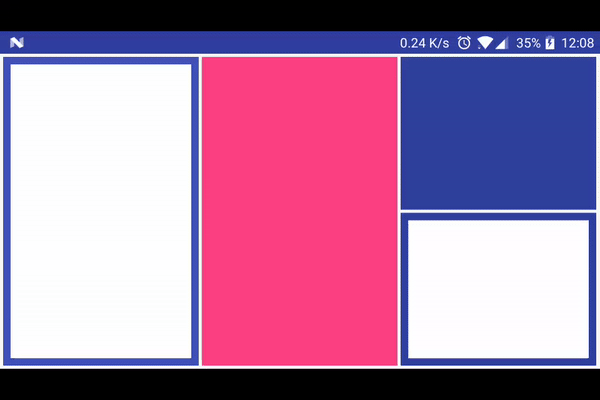

MetroLayout
=========
设计师提交的UI有点类似Window的Metro桌面，搜了几把没发现特别适合的Demo，于是准备自己造个轮子。磨磨蹭蹭搞了好久，发现平时用轮子多了，自个造起来，还是有挺多小麻烦的，项目的时间又比较紧，先这样吧，以后有了时间再完善。

小结
------
* 自定义ViewGroup， 每次onlayou都要记得child.onlayout，不然addView不显示
* 自己写View滑动太麻烦，一个ViewDragHelper不够就多弄几个（偷赖）
* 系统的rect.contains(x, y)竟然不包含right和bottom，走了些弯路，查看源码很重要